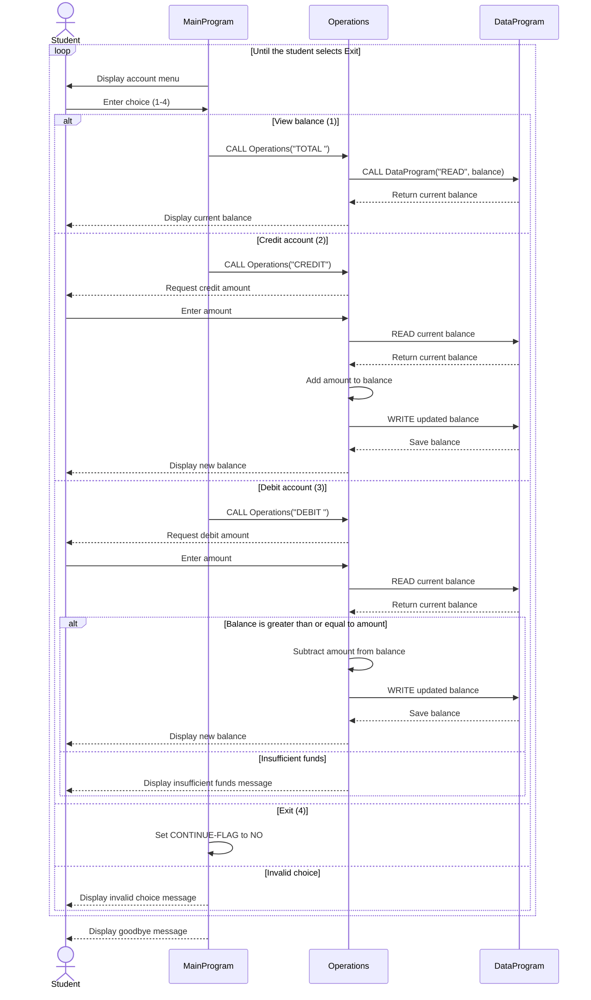

# Student Account COBOL Application

This directory documents the small COBOL account-management application in
`src/cobol`. The program provides a console menu for viewing a student's
balance, crediting the account, debiting the account, and exiting.

## File Responsibilities

### `data.cob`

`data.cob` is the balance data component. It stores the current balance in
`STORAGE-BALANCE` and exposes a procedure that accepts an operation and a
balance through the linkage section:

- `READ` copies the stored balance to the caller's `BALANCE` field.
- `WRITE` replaces the stored balance with the caller's `BALANCE` field.

The storage is initialized to `1000.00` and exists only for the lifetime of
the running program.

### `operations.cob`

`operations.cob` implements account actions requested by the main program. It
accepts a six-character operation code and handles:

- `TOTAL `: reads and displays the current balance.
- `CREDIT`: reads an amount, adds it to the balance, saves the result, and
  displays the new balance.
- `DEBIT `: reads an amount, checks available funds, subtracts the amount when
  allowed, saves the result, and displays the new balance.

It calls `DataProgram` for all balance reads and writes rather than changing
the data component's storage directly.

### `main.cob`

`main.cob` is the console entry point and menu controller. It repeatedly
displays the account menu, accepts a numeric choice, and calls `Operations`
with the corresponding operation code. Choices `1` through `4` map to view
balance, credit, debit, and exit. Any other choice displays an error and shows
the menu again.

## Student Account Business Rules

- Each run starts with one account balance of `1000.00`.
- A balance can be viewed without changing it.
- A credit increases the balance by the entered amount.
- A debit is allowed only when the current balance is greater than or equal
  to the entered amount. Otherwise, the debit is rejected and the balance is
  unchanged.
- The application does not permit an overdraft through the debit path.
- The current implementation has no student ID, account selection, or
  persistent storage, so all users share the single in-memory balance during
  one run and the balance resets when the program exits.
- Credit and debit amounts are accepted as entered. There is no explicit
  validation for zero, negative, or out-of-range amounts, so those cases are
  outside the implemented business rules and should be addressed before
  production use.
- Account values use a six-digit whole-number field with two decimal places
  (`PIC 9(6)V99`), and operation codes use six-character fields (`PIC X(6)`).

## Runtime Flow

1. `MainProgram` presents the menu and reads a choice.
2. `MainProgram` calls `Operations` with `TOTAL `, `CREDIT`, or `DEBIT `.
3. `Operations` calls `DataProgram` with `READ` to obtain the current balance.
4. For a credit or an approved debit, `Operations` changes the balance and
   calls `DataProgram` with `WRITE`.
5. Control returns to `MainProgram`, which displays the menu again until the
   user selects exit.

## Data Flow Sequence Diagram

